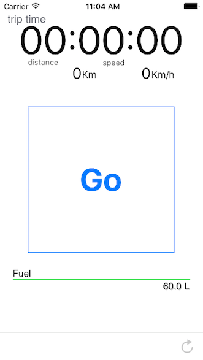

# Driver's Rest
A simulation app using KVO, GCD and ARTProgressView control

An app which alerts you periodically that you should take a driving break, how many kilometers have you travelled so far and how much gas your car's tank has left. 

No geolocation of any sorts. Just simulating.

